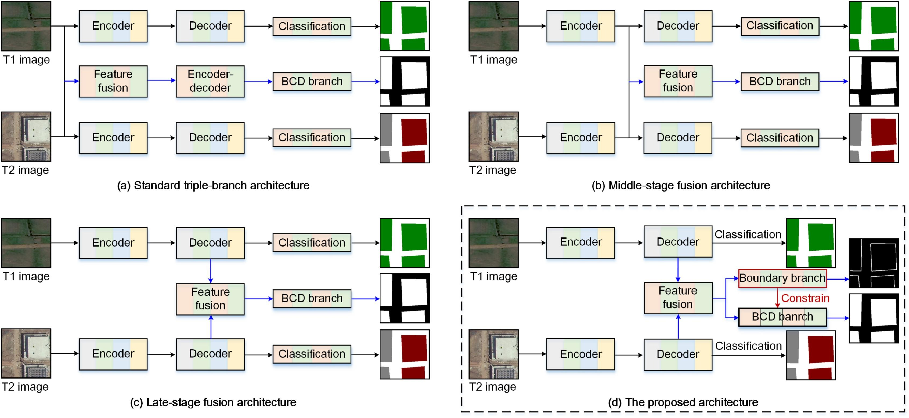

# SMGNet

Official Pytorch Code base for "BGSNet: A boundary-guided Siamese multitask network for semantic change detection from high-resolution remote sensing images" [Paper](https://www.sciencedirect.com/science/article/pii/S0924271625001728?via%3Dihub)

## Introduction

This paper develops a boundary-guided Siamese multitask network, namely BGSNet, for the purpose of semantic change detection (SCD) from high-resolution remote sensing images. The objective of BGSNet is to utilize robust boundary semantics to enhance the intra-class consistency of change features, alleviating the pseudo-changes caused by temporal variances while retaining well boundary details. 

<p align="center">
  
</p>

## Using the code:

The code is stable while using Python 3.9.0, CUDA >=11.2

- Clone this repository:
```bash
git clone https://github.com/long123524/BGSNet
cd BGSNet
```

To install all the dependencies using conda or pip:

```
PyTorch
TensorboardX
OpenCV
numpy
tqdm
skimage
...
```

## Data Format

Make sure to put the files as the following structure:

```
inputs
└── <train>
    ├── image1
    |   ├── 001.tif
    │   ├── 002.tif
    │   ├── 003.tif
    │   ├── ...
    |
    └── image2
    |   ├── 001.tif
    |   ├── 002.tif
    |   ├── 003.tif
    |   ├── ...
    └── label1
    |   ├── 001.tif
    |   ├── 002.tif
    |   ├── 003.tif
    |   ├── ...
    └── label2
    |   ├── 001.tif
    |   ├── 002.tif
    |   ├── 003.tif
    |   ├── ...
    └── ...
    
```

For testing and validation datasets, the same structure as the above.

## Datasets

JL-1 dataset: https://www.jl1mall.com/store/ResourceCenter.
HRSCD dataset: https://ieee-dataport.org/open-access/hrscd-high-resolution-semantic-change-detection-dataset#files.
A preprocessed dataset of cropland non-agriculturalization in Fuzhou is available at https://drive.google.com/file/d/1SlTw3jKr3cE6d3i5XYQhzylG0geMzNZW/view?usp=sharing.

## Training and testing

Will be available.

## A pretrained weight
A pretrained weight of PVT-V2 on the ImageNet dataset is provided: https://drive.google.com/file/d/1uzeVfA4gEQ772vzLntnkqvWePSw84F6y/view?usp=sharing

### Acknowledgements:

This code-base uses certain code-blocks and helper functions from [HGINet](https://github.com/long123524/HGINet-torch) and [BiSRNet](https://github.com/DingLei14/Bi-SRNet).

### Citation:
If you find this work useful or interesting, please consider citing the following references.
```

@article{long2025,
  title={BGSNet: A boundary-guided Siamese multitask network for semantic change detection from high-resolution remote sensing images},
  author={Long, Jiang and Liu, Sicong and Li, Mengmeng and Zhao, Hang and Jin, Yanmin},
  journal={ISPRS Journal of Photogrammetry and Remote Sensing},
  volume={225},
  pages={221--237},
  year={2025},
  publisher={Elsevier}
}

@article{long2024,
  title={Semantic change detection using a hierarchical semantic graph interaction network from high-resolution remote sensing images},
  author={Long, Jiang and Li, Mengmeng and Wang, Xiaoqin and Stein, Alfred},
  journal={ISPRS Journal of Photogrammetry and Remote Sensing},
  volume={211},
  pages={318--335},
  year={2024},
  publisher={Elsevier}
}

@article{long2025,
  title={SMGNet:A Semantic Map-Guided Multitask Neural Network for Remote Sensing Image Semantic Change Detection},
  author={Long, Jiang and Liu, Sicong and Li, Mengmeng},
  journal={IEEE GEOSCIENCE AND REMOTE SENSING LETTERS},
  volume={22},
  pages={1--5},
  year={2025},
  publisher={IEEE}
}
```
